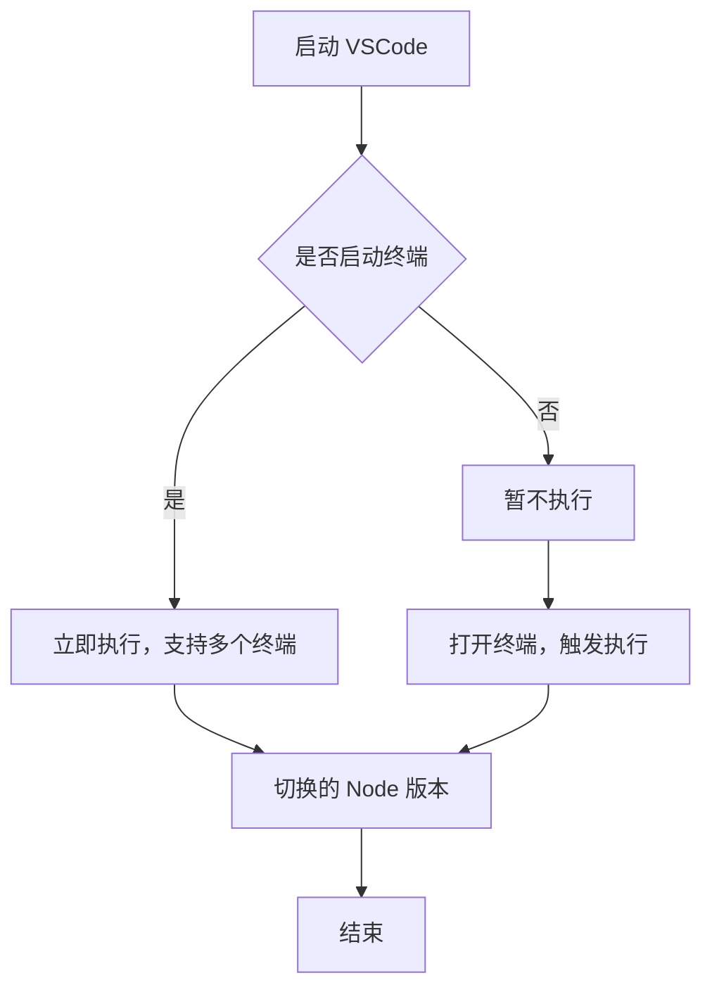

# 快速开发一个 VSCode 插件

> 以下是工作开发遇到一些扩展的问题，记录写下一个 VSCode 插件： 自动切换配置的 Node 版本

## 背景

开发项目的过程中，是否遇到

- 效率
- 业务代码
- 扩展
- ...

等等一些问题的瓶颈，想自己开发一些其他的项目来提升编程的多样性

## 插件目标

> 前提已经安装了 nvm 或者 n 切换版本的工具

`兼容`

- Unix/Linux/macOS
- Windows

当打开 VSCode 项目终端时，直接根据配置的 Node 版本进行切换，而不需要手动切换

- 自动触发命令
  - nvm use version
  - n version

> 像 Python venv 创建虚拟环境类似

```shell
# macos
# 创建虚拟环境
python -m venv .venv
# vscode 打开终端自动识别创建的环境
source .venv/bin/activate
```

> 手动切换

前提是已经安装 nvm 或者 n

```shell
nvm use {version}
```

or

```shell
n {version}
```

### 安装指引

> macOS/Linux

```shell
# 下载安装参考
# https://github.com/nvm-sh/nvm
```

> Windows

```shell
# 下载并安装 nvm-windows
# https://github.com/coreybutler/nvm-windows/releases
```

### N (仅 Unix/Linux/macOS)

```shell
npm install -g n
```

## 插件开发介绍

插件的实现并不难，利用 AI 的编码能力你也可以完全实现

### Reactive VSCode

[原生 VSCode Extension API](https://code.visualstudio.com/api/get-started/your-first-extension)
[Reactive VSCode Extension API 访问地址](https://kermanx.com/reactive-vscode/)

插件使用 Reactive VSCode 扩展库实现，简单介绍下

- 封装 VSCode 原生的 API
- 提供 Vue3 的 API 开发体验
  - watchEffect
  - defineConfig
  - defineExtension
  - useActiveTextEditor
  - ...

### 搭建项目

```shell
# pnpm
pnpm create reactive-vscode
```

### 调试

利用 CLI 创建的项目

- src/extension.ts 入口文件
- .vscode
  - launch.json 调试配置

```json
{
  "version": "0.2.0",
  "configurations": [
    {
      "name": "Run Extension",
      "type": "extensionHost",
      "request": "launch",
      "args": ["--extensionDevelopmentPath=${workspaceFolder}"],
      "outFiles": ["${workspaceFolder}/dist/**/*.js"]
    }
  ]
}
```

[利用 VSCode 自带的 Run And Debug](https://code.visualstudio.com/api/get-started/your-first-extension#debugging-the-extension)

- Run Extension

## 插件实现

[以下是思考的步骤，具体实现可以参考](https://github.com/LIUeng/node-env)

### 配置

可以定义一些配置参数，控制是否执行等等

```json package.json
"contributes": {
    "configuration": {
      "title": "Node Environment",
      "properties": {}
    }
  }
```

### 触发时机

等待工作区加载完毕，是否有终端打开



### 获取命令

- 提前检测是否已经安装
  - nvm
  - n

> 不同环境执行的命令有所区别

#### MacOS/Unix/Linux

- zsh
- bash
- fish
- sh

#### Windows

- powershell
- git-bash
- cmd

找到各自系统安装的终端命令，是否安装了 nvm 或者 n，来获取执行命令

> 利用 Node child_process 检测执行相关命令

```js
import { spawn } from "child_process";
// windows macos 兼容
spawn([command], args, config /* 命令执行配置 */);
// 例如执行 nvm
// windows
spawn(["nvm"], ["version"] /* 命令执行配置 */);
// macos
spawn(["nvm"], ["--version"] /* 命令执行配置 */);
```

#### 配置文件

找到配置的 Node 版本，进行确认切换

> `.nvmrc` 文件

```
18.17.0
```

> `.node-version` 文件

```
18.17.0
```

> `.tool-versions` 文件 (ASDF)

```
nodejs 18.17.0
```

> `package.json` 文件

**Volta 配置：**

```json
{
  "volta": {
    "node": "18.17.0"
  }
}
```

**Engines 配置：**

```json
{
  "engines": {
    "node": ">=18.0.0"
  }
}
```

比对当前 Node 的版本，如果一致，则不进行切换

### 执行命令

如何执行切换 Node 版本的命令

- 检查已经打开的终端列表

```js
import { window } from "vscode";
window.terminals;

// nvm
let command = "nvm use {version}";
// n
command = "n {version}";
```

- 监听终端打开事件

```js
window.onDidOpenTerminal((terminal) => {
  // terminal.sendText(command);
});
```

- 执行命令 API

```js
terminal.sendText(command);
```

- 切换结束

## 插件发布

测试完毕，进行发布

[VSCode 插件发布指南](https://code.visualstudio.com/api/working-with-extensions/publishing-extension)

## 总结

- 初始项目
- 开发项目
  - 插件类型
  - 插件的触发时机
  - 考虑兼容多系统 unix/linux/macos/window
  - 插件如何运行
- 调试项目
- 测试项目
- 发布项目

## END

附

[Node Env Pro 代码地址](https://github.com/LIUeng/node-env)
[Node Env Pro 自动切换 Node 版本插件地址](https://marketplace.visualstudio.com/items?itemName=LIUeng.node-env-pro)
